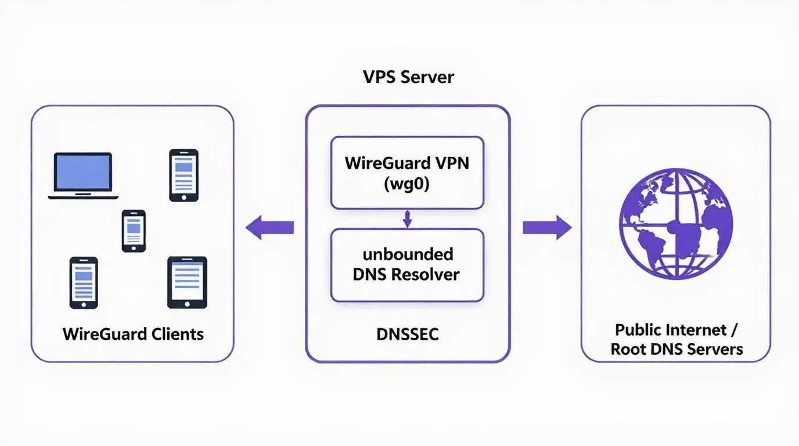

# Architecture Overview

## System Context

This DNS resolver runs on a Contabo VPS hosting the ECN2026 infrastructure. It provides recursive DNS resolution for clients connected via WireGuard VPN (`10.100.0.0/24`), with full DNSSEC validation and comprehensive monitoring.

## High-Level Diagram

## Core Components

| Component | Image/Type | Purpose | Network Binding |
|-----------|------------|---------|-----------------|
| Unbound | `klutchell/unbound:latest` | Recursive DNS resolver with caching | `10.100.0.1:53` |
| Unbound Prometheus Exporter | — | Exposes metrics for scraping | Internal |
| Prometheus | Existing | Metrics collection | Scrapes exporter |
| Grafana | Existing | Visualization | Dashboards for DNS metrics |
| WireGuard | Host | VPN access control | `wg0` interface |
| nftables | Host | Firewall rules | Table `inet meinefirewall` |

## Security Model

- **Access Control**: Unbound is only reachable via WireGuard interface (`wg0`) at `10.100.0.1`
- **DNSSEC**: End-to-end signature validation enabled in `unbound.conf`
- **Firewall**: Manual nftables rules (Docker iptables integration disabled via `"iptables": false`)
- **Network Isolation**: Client subnet `10.100.0.0/24` isolated from host network

## Data Flow

1. Client connects via WireGuard VPN → obtains IP in `10.100.0.0/24`
2. DNS query sent to `10.100.0.1:53` (Unbound)
3. Unbound performs recursive resolution using root hints
4. DNSSEC validation performed on all responses
5. Query logged internally + metrics exposed via Prometheus exporter
6. Prometheus scrapes metrics → Grafana visualizes cache hit rate, query latency, etc.

## Configuration Files

- [`unbound.conf`](../configuration/unbound.conf) — Annotated Unbound configuration
- [`docker-compose.yml`](../configuration/docker-compose.yml) — Service definitions
- [`nftables-rules.md`](../configuration/nftables-rules.md) — DNS-specific firewall rules

## Related Documentation

- [Architecture Decisions](../decisions/) — ADR format (Context/Decision/Reasoning/Trade-offs)
- [Lessons Learned](../lessons-learned/learned.md) — Issues encountered and resolved

---

**Status**: Finished
